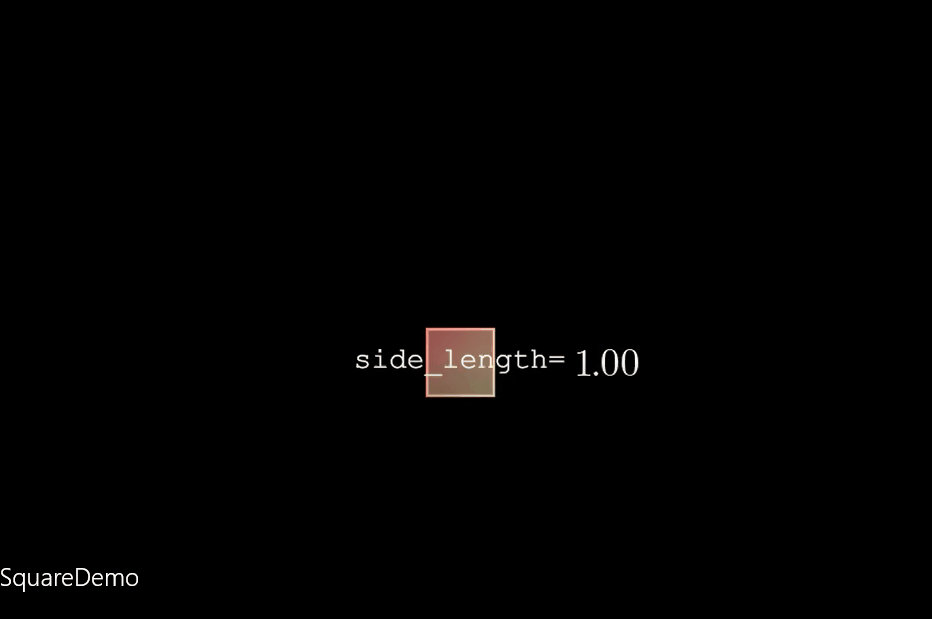
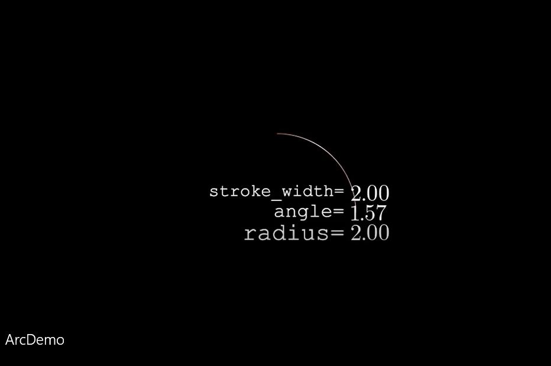

# DemoClass

[`DemoClass`](https://github.com/pacria/MyManimAnimation/blob/master/tutorial/democlass/DemoClass.py)被设计用来创建一般演示的动画，使用`DemoClass`可以方便地对一个或几个属性值进行调控。目前`DemoClass`还有一些不足之处

### Example1| SquareDemo

对`Square`的演示是一个基本的例子，在`SquareDemo`这个场景中，其中使用到了`DemoClass`

```python
...
# square
square = Square(side_length=2)\
	.set_fill(color=WHITE, opacity=.6).set_color_by_gradient([YELLOW_A, RED_B])       
square_demo = DemoClass(
            square, # square
            {"side_length":(1, 5)} # main attribute
        )

...
```

我们希望演示`side_length`属性对`Square`的作用（后来我们知道`side_length`即`Square`的**边长**），要使用`DemoClass`，只需要先***创建一个`Square`的实例***，即`square`，然后将其传入到`DemoClass`以便创建`square_demo`

在创建`square_demo`的过程中，为了说明将要被改变的属性是`side_length`，且`side_length`由`1`变动到`5`，同时需要***传入一个字典`{"side_length":(1, 5)}`***, 格式为`{attr_name:(init_val, end_val)}`，其中`attr_name`是我们在演示中想要改变的对象——也就是`square`的特定属性名——也即是`side_length`, `init_val`和`end_val`是我们希望属性值的变动区间，告诉我们`side_length`将从`init_val`(在这里是`1`)变动到`end_val`(在这里是`5`)

使用`DemoClass`还可以有多个可变的属性值，下面的第二个例子——`ArcDemo`演示了这是如何做到的

接着使用

```python
print(repr(square_demo))
```

以便查看有关信息，`DemoClass`的属性`group`是对其内部全部`mobjects`的封装。因此***写上`self.add(square_demo.group)`***，就可以将整个`DemoClass`加入到场景中

最后是动画部分，`DemoClass`有一个方法`get_anim()`，用来获取所有的动画（即`Animation`的实例）,它还可以传入一些参数，例如`run_time`，这些参数最终将传递给上面讲的各`Animation`实例中去

```python
self.play(AnimationGroup(
            *square_demo.get_anim(run_time=3)
        ))
```

整体运行的动画演示




这就是使用`DemoClass`的最基本的工作流程了。由于是本人实现的，所以并不复杂，实际上是把一些演示时可能用到的公共部分封装起来了。下面这个例子——`ArcDemo`，展示了如何利用`DemoClass`创建多属性的同时控制过程

### Example2| ArcDemo

完整的`ArcDemo`

```python
class ArcDemo(Scene):
    def construct(self):
        arc = Arc()\
        .set_color_by_gradient([GOLD_D, RED_B, YELLOW_A, RED_D])
        arc_demo = DemoClass(
            arc,
            { 
            "angle":(TAU/4, 2*PI), # angle: TAU/4 -> 2*PI
            "radius":(2, 4), # radius: 2 -> 4
            "stroke_width":(2, 22)} # stroke_width: 2 -> 22
        )

        print(repr(arc_demo))

        self.add(arc_demo.group)

        self.play(LaggedStart(
            *arc_demo.get_anim(run_time=3)
        ))
```

动画演示为



